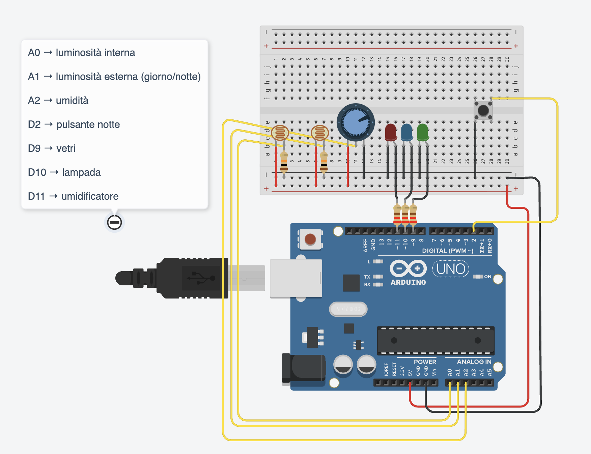
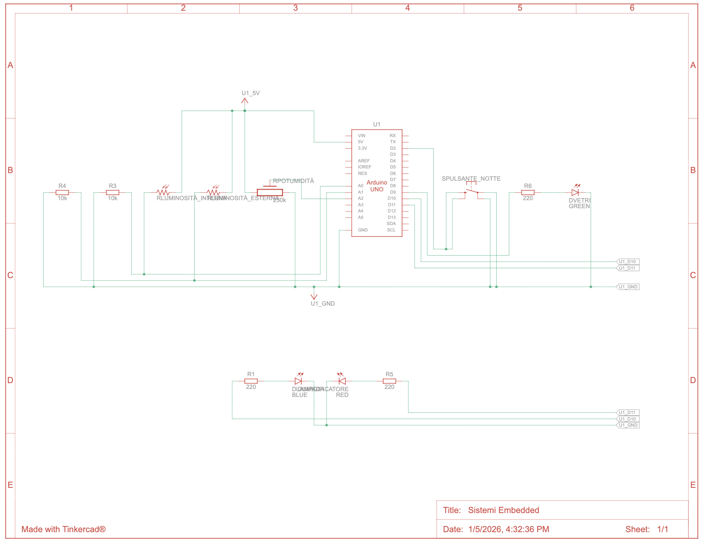
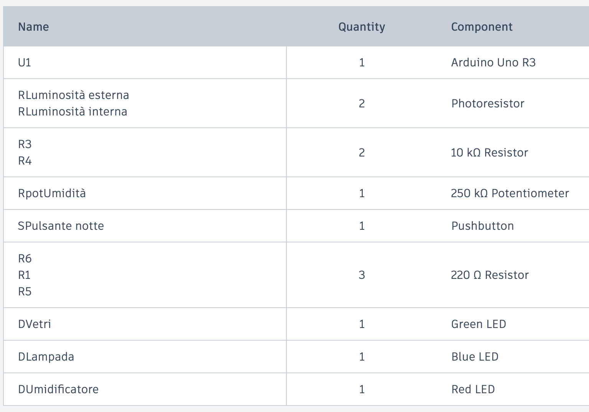

# SISTEMI EMBEDDED  
## Progetto di Sistema a Microcontrollore  
### Controllo di Illuminazione e Umidità di una Stanza



## Simulazione 3D (Vite + Three.js)

È disponibile una **simulazione 3D interattiva** del progetto, realizzata con **Vite** e **Three.js**, in una repository dedicata:

- **Repo simulazione 3D**: [`embedded-threejs`](https://github.com/rstlgu/embedded-threejs)
- **Demo web**: [`embedded-threejs.vercel.app`](https://embedded-threejs.vercel.app/)

**Risorse rapide**
- **Simulazione Tinkercad**: [Sistemi Embedded (Tinkercad)](https://www.tinkercad.com/things/gh0BfnCoX2i-sistemi-embedded?sharecode=TTvGELNoZXECAcyFkoqlZ9h0icSk7ExSVsb0CLtjCKg)
- **Codice sorgente (C / Arduino)**: [`code.c`](./code.c)

---

## 1. Introduzione
Il progetto ha come obiettivo la realizzazione di un **sistema embedded basato su microcontrollore**
in grado di controllare le condizioni di **illuminazione** e **umidità** di una stanza.
Il sistema opera in modo differenziato durante la **fase diurna** e la **fase notturna**, nel rispetto
delle specifiche assegnate.

Il progetto implementa **il sistema completo (Opzione 3)**

---

## 2. Modalità di Realizzazione

### 2.1 Piattaforma utilizzata
La fase di progettazione e simulazione è stata svolta utilizzando **Tinkercad Circuits**,
con una scheda **Arduino UNO** come microcontrollore.
La programmazione è stata effettuata in linguaggio **C**, tramite l’IDE Arduino integrato.

---

## 3. Architettura del Sistema

### 3.0 Schema del circuito



### 3.1 Sensori
- Fotoresistenza interna: misura la luminosità all’interno della stanza.
- Fotoresistenza esterna: consente di discriminare tra giorno e notte tramite una soglia.
- Sensore di umidità (simulato con potenziometro).

### 3.2 Attuatori
- Vetri a cristalli liquidi: simulati tramite uscita PWM.
- Illuminazione artificiale: lampada a intensità variabile (PWM).
- Sistema di umidificazione: comando analogico simulato tramite PWM.

### 3.3 Comando esterno
- Pulsante digitale per la selezione di valori notturni alternativi.

### 3.4 Componenti principali (Tinkercad)



---

## 4. Macchina a Stati Finiti (FSM)

### 4.1 Stati definiti
- INIT
- CHECK_DAY_NIGHT
- DAY_LIGHT
- DAY_HUM
- HUM_ON
- NIGHT_LIGHT
- NIGHT_HUM
- WAIT

### 4.2 Descrizione del funzionamento
La FSM consente di separare logicamente le diverse fasi operative:
- Discriminazione giorno/notte
- Controllo della luminosità
- Controllo dell’umidità
- Gestione temporizzata degli attuatori

### 4.3 Tabella degli stati (sintesi)

| Stato | Descrizione |
|------|-------------|
| INIT | Inizializzazione |
| CHECK_DAY_NIGHT | Scelta modalità giorno/notte |
| DAY_LIGHT | Controllo luce diurna |
| DAY_HUM | Controllo umidità diurna |
| HUM_ON | Umidificatore attivo (1 min) |
| NIGHT_LIGHT | Impostazione luce notturna |
| NIGHT_HUM | Impostazione umidità notturna |
| WAIT | Attesa temporizzata |

---

## 5. Implementazione Software

Il sistema è stato implementato in linguaggio **C**, utilizzando una macchina a stati finiti
con temporizzazioni **non bloccanti** basate sulla funzione `millis()`.
Le uscite PWM simulano un comando in tensione continuo, come richiesto dalle specifiche.

Durante la fase di test sono stati utilizzati **tempi ridotti**, successivamente riconvertiti
ai valori reali previsti dal progetto.

### 5.1 Struttura della FSM (stati e transizioni)

Dal firmware (`code.c`) si definiscono gli stati della macchina e uno stato corrente:

```c
enum State {
  INIT,
  CHECK_DAY_NIGHT,
  DAY_LIGHT,
  DAY_HUM,
  HUM_ON,
  NIGHT_LIGHT,
  NIGHT_HUM,
  WAIT
};

State state = INIT;
```

Nel `loop()` la logica è centralizzata in uno `switch (state)`, così ogni stato rimane una fase
funzionale chiara e facilmente debuggabile (via `Serial.println`):

```c
void loop() {
  switch (state) {
    case CHECK_DAY_NIGHT:
      if (analogRead(L_EXT) > DAY_TH) state = DAY_LIGHT;
      else state = NIGHT_LIGHT;
      t_state = millis();
      break;
    // ...
  }
}
```

### 5.2 Temporizzazioni non bloccanti con `millis()`

Per evitare `delay()` (che bloccherebbe l’esecuzione) la temporizzazione usa differenze tra tempi:

```c
case HUM_ON:
  if (millis() - t_state >= T_HUM) {
    analogWrite(HUMID, 0);
    state = WAIT;
    t_state = millis();
  }
  break;
```

- **Perché funziona**: mentre si “aspetta”, la MCU continua a ciclare nel `loop()` senza fermarsi.
- **Vantaggio**: comportamento reattivo e semplice estensione con nuovi stati/controlli.

### 5.3 Controllo luminosità diurna (PWM su vetri e lampada)

In modalità giorno, la luminosità interna (`L_INT`) governa gli attuatori:

```c
void dayLightControl() {
  int L = analogRead(L_INT);

  if (L > L_MAX) {
    analogWrite(WIN, map(L, L_MAX, 1023, 80, 255));
    analogWrite(LAMP, 0);
  } else if (L < L_MIN) {
    analogWrite(LAMP, map(L, 0, L_MIN, 255, 80));
    analogWrite(WIN, 0);
  } else {
    analogWrite(WIN, 0);
    analogWrite(LAMP, 0);
  }
}
```

- **Caso “troppa luce”**: aumento opacità dei vetri (`WIN`) e spengo la lampada.
- **Caso “troppo buio”**: accendo la lampada (`LAMP`) e lascio i vetri trasparenti.
- **Caso “ok”**: entrambi a 0 per risparmio energetico.

---

## 6. Fase di Test e Debug

Il corretto funzionamento del sistema è stato verificato tramite:
- Serial Monitor per il debug degli stati FSM
- Simulazione delle condizioni ambientali
- Verifica delle transizioni di stato

Sono stati testati:
- Funzionamento diurno
- Funzionamento notturno
- Umidificazione temporizzata
- Comando esterno

---
